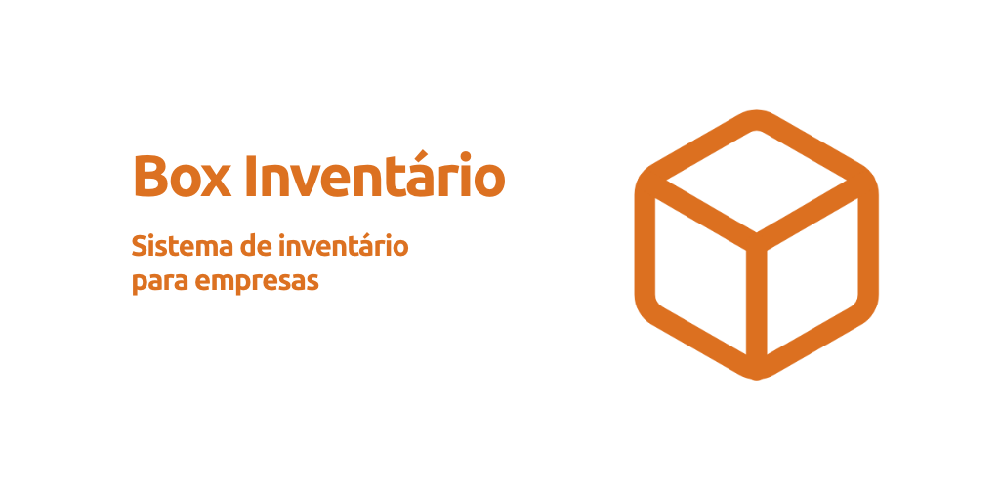
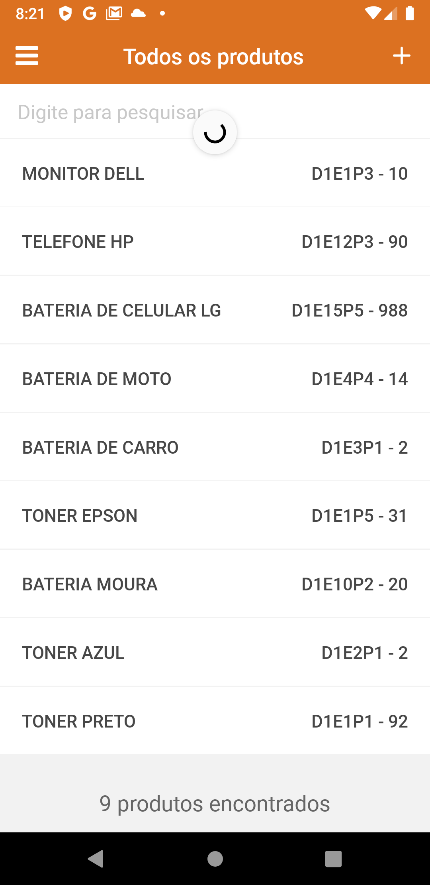
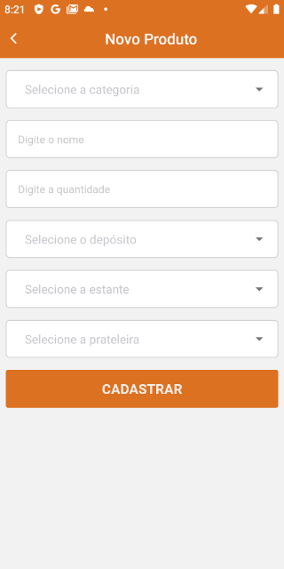
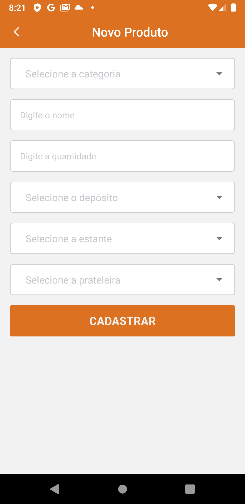
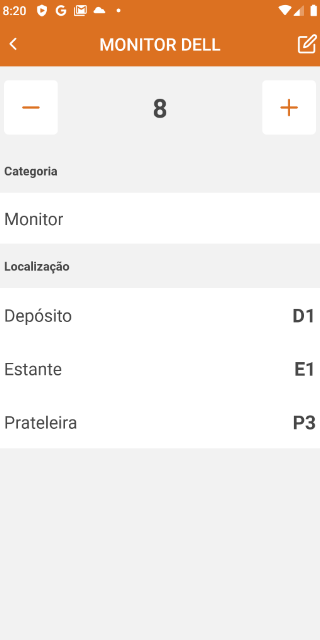
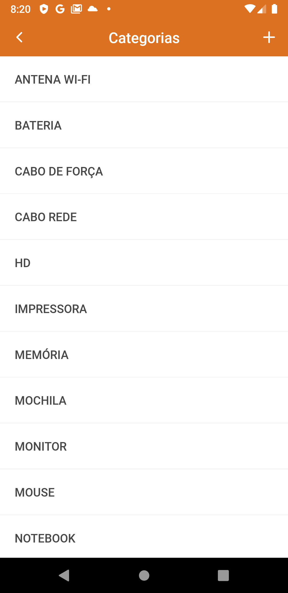
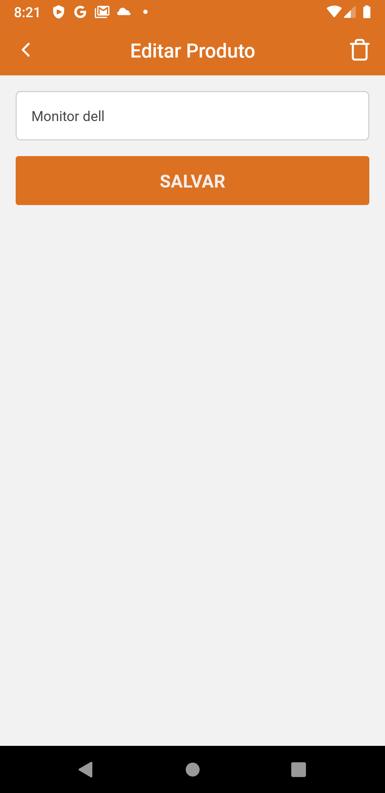
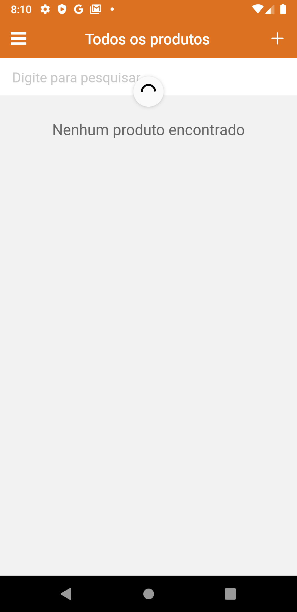
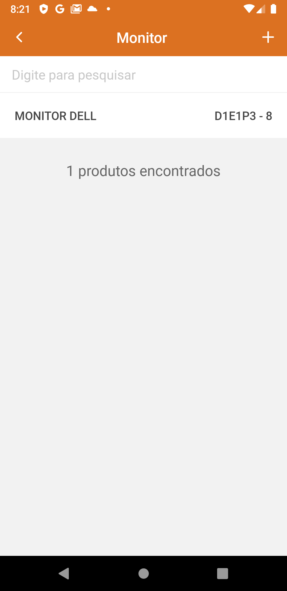

<h4 align="center">
    
</h4>

<h1 align="center">
    Box Inventário
</h1>

## :bookmark: Sobre

Desenvolvimento de uma aplicação para consulta de produtos no depósito de uma empresa.

No app é possível cadastrar produtos nos depósito, com categoria, estante, prateleira e a quantidade.

O sistema está integrado com uma API interna para cadastrar os produtos.

## :rocket: Tecnologias Utilizadas

O projeto foi desenvolvido utilizando as seguintes tecnologias

- [React Native](https://reactnative.dev/)
  - [React Native Communications](react-native-communications)
- [React Navigation v5](https://reactnavigation.org/)
- [Styled Components](https://styled-components.com/)
- [Axios](https://github.com/axios/axios)
- [Expo](https://expo.io/)

## :iphone: Telas

<h4 align="center">
    
    
    
    
    
    
        
        
        

</h4>

---

<h4 align="center">
    Feito com 💜 by Deusdete Filho</a>
</h4>
